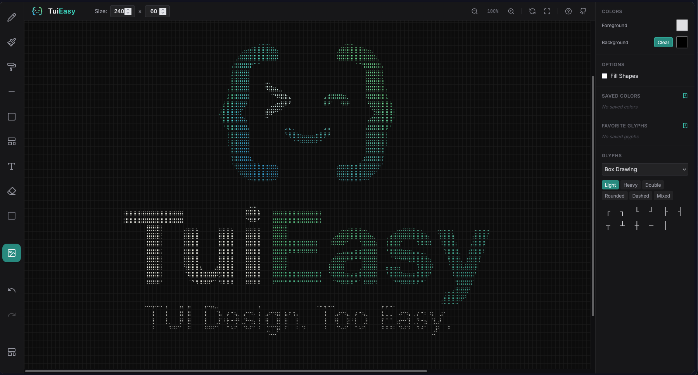

<div align="center">



# TuiEasy

### TUI Design. Too Easy.

The open-source visual editor for terminal user interfaces.
Draw layouts with mouse, touch, or Apple Pencil. Export to ANSI. Feed it to your AI agent. Ship faster.

[](LICENSE)
[](https://react.dev/)
[](https://vitejs.dev/)
[](https://tailwindcss.com/)

[**Try It Live →**](https://tuieasy.com) · [Report Bug](https://github.com/WatchmanReeves/TuiEasy/issues) · [Request Feature](https://github.com/WatchmanReeves/TuiEasy/issues)

</div>

---

## ✨ Features

| Feature | Description |
|---------|-------------|
| ✏️ **Freehand Drawing** | Pencil, line, rectangle, and smart box tools. Mouse, touch, & Apple Pencil. |
| 📐 **Smart Boxes** | Auto-connecting box-drawing characters — Light, Heavy, Double, Rounded, Dashed, Mixed. |
| 🖼️ **Image Import** | Convert any image to terminal art using half-block color or braille dot patterns. |
| 📥 **ANSI Export & Import** | Full 24-bit color `.ans` files. Import existing ANSI art to edit and remix. |
| 🔤 **Glyph Library** | 500+ Unicode glyphs — box drawing, braille, blocks, geometry, alphanumerics. Save favorites. |
| 💾 **Design Library** | Save/load designs from localStorage. Premade templates (file explorer, chat UI). |
| 🎨 **Color Tools** | Foreground/background color pickers, transparency, saved color palette. |
| 🔍 **Zoom & Pan** | Pinch to zoom, scroll to navigate. Fit-to-screen and reset. |
| ↩️ **Undo/Redo** | Full history with Cmd/Ctrl+Z support. |

---

## 🚀 The Magic Workflow

```
┌─────────────────┐     ┌─────────────────┐     ┌─────────────────┐
│                  │     │                  │     │                  │
│  1. SKETCH       │────▶│  2. EXPORT       │────▶│  3. AI AGENT     │
│                  │     │                  │     │                  │
│  Draw your TUI   │     │  One-click ANSI  │     │  Paste layout    │
│  layout visually │     │  export with     │     │  into Claude,    │
│  with any input  │     │  full 24-bit     │     │  GPT, or your    │
│  device          │     │  color codes     │     │  coding agent    │
│                  │     │                  │     │                  │
└─────────────────┘     └─────────────────┘     └─────────────────┘
```

Design a TUI layout visually → Export it as ANSI → Feed the ANSI output to your AI coding agent → Get a fully working TUI back.

---

## 🛠️ Tech Stack

| Technology | Purpose |
|-----------|---------|
| [React 19](https://react.dev/) | UI framework |
| [Vite 6](https://vitejs.dev/) | Build tooling & dev server |
| [Tailwind CSS 4](https://tailwindcss.com/) | Styling |
| [Lucide React](https://lucide.dev/) | Icons |
| [TypeScript](https://www.typescriptlang.org/) | Type safety |
| Canvas API | Grid rendering engine |

---

## 🏃 Local Development

**Prerequisites:** [Node.js](https://nodejs.org/) (v18+) and npm or pnpm.

```bash
# Clone the repository
git clone https://github.com/WatchmanReeves/TuiEasy.git
cd TuiEasy

# Install dependencies
pnpm install    # or: npm install

# Start the dev server
pnpm dev        # or: npm run dev
```

The app will be available at **http://localhost:3000**

- `/` — Landing page
- `/app` — TUI Editor

### Build for Production

```bash
pnpm build      # or: npm run build
```

Output goes to `dist/` — a fully static site ready for deployment.

---

## 🎯 Keyboard Shortcuts

| Shortcut | Action |
|----------|--------|
| `⌘/Ctrl + Z` | Undo |
| `⌘/Ctrl + Shift + Z` | Redo |
| `⌘/Ctrl + Scroll` | Zoom in/out |
| `?` | Toggle Help modal |

---

## 📹 Demo

<!-- Replace with your actual demo video/GIF -->
> 🎬 **Demo video coming soon** — Recording screen captures of the full workflow.
>
> In the meantime, [try it live](https://tuieasy.com) or run it locally!

---

## 🤝 Contributing

Contributions are welcome! Here's how:

1. **Fork** the repository
2. Create a **feature branch** (`git checkout -b feature/amazing-feature`)
3. **Commit** your changes (`git commit -m 'Add amazing feature'`)
4. **Push** to the branch (`git push origin feature/amazing-feature`)
5. Open a **Pull Request**

### Ideas for Contributions
- [ ] Additional export formats (SVG, PNG, React components)
- [ ] Copy/paste selection tool
- [ ] Layer support
- [ ] Collaborative editing
- [ ] More premade templates

---

## 📄 License

This project is licensed under the **GNU Affero General Public License v3.0** — see the [LICENSE](LICENSE) file for details.

This means:
- ✅ Free to use, modify, and distribute
- ✅ Must disclose source code of modifications
- ✅ Network use counts as distribution
- ⚠️ Derivative works must use the same license

---

## 🌟 Star History

If TuiEasy helps your workflow, consider giving it a ⭐ on GitHub!

---

<div align="center">
  <sub>Built with ❤️ by <a href="https://github.com/WatchmanReeves">WatchmanReeves</a></sub>
  <br />
  <sub>TUI Design. Too Easy. >_</sub>
</div>
